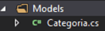
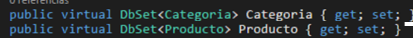

# ASPNetCore_EFC_CodeFirst
 

> ## Enfoque Code First 
>Es un enfoque muy popular y **tiene control total sobre el código en lugar de la actividad de la base de datos.**
> En este enfoque, podemos hacer todas las operaciones de la base de datos desde el código, todos los cambios manuales a la base de datos se perderán, todo depende del código.

 

## Instalar Entity Framework Core, desde el Package NuGet:

Y las herramientas de EF Core:

 

## Creando el Modelo de Datos
Sobre la carpeta Models, ir al menú Agregar -> Nuevo Elemento y seleccionamos Clase, con el nombre: Categoría. Se agrega las siguientes propiedades.

Para la clase **Producto** se agrega las siguientes propiedades:

 

### Agregar la clase del Contexto de la base de datos llamada **DbContexto**

 

Creamos dos constructores:

* Este constructor está vacío.

 

* Y el segundo constructor, espera por parámetro opciones que es un objeto de DbContextOptions.

 

Declaramos las propiedades para exponer el modelo

 

Por último sobre escribir el método **OnModelCreating**. El método, nos permite mapear nuestras Entidades con la base de datos y le enviamos como parámetro un objeto que instancia de la clase **ModelBuilder**.

 

## Registro del contexto con Inyección de Dependencias
ASP.NET Core implementa la **inyección de dependencia** de forma predeterminada. Los
servicios (como el contexto de la base de datos EF) se registran con la inyección de
dependencia durante el inicio de la aplicación. Los componentes que requieren estos
servicios (como los controladores MVC) se proporcionan a través, de parámetros de
constructor.

Se agrega la cadena de conexión de la BD, en el archivo **appsettings.json**

  `"ConnectionStrings": {
    "DefaultConnection": "Data Source=(localdb)\\MyInstance;Initial Catalog=dbproductosCodeFirst"
  },`

 

El contexto de la base de datos **DbContexto** se registró como un servicio
en **Startup.cs**, en el metodo `ConfigureServices()`.

> De esta manera se hace la **Inyección de Dependencias**.

 

## Migraciones para crear la base de datos
Se va a migrar la estructura de Categoria y Producto, desde la consola **Nuget Package Manager**

 

#### Agregar la Primera Migración, con el siguiente comando:

* `Add-Migration primera-migracion`

 

Cuando termina, se genera la carpeta **Migrations**, donde se muestra la primera migración. Donde se encuentra la definición para poder crear la base de datos con las tablas categorías y productos.

 

#### Ejecutar la migración con el siguiente comando: 
* `Update-Database`

 

Abrimos el Sql Server, y se muestra la base de datos creada y las talas.

 

#### Agregar una columna nueva a la tabla Categoría:
1.	En la clase Categoría agregamos la siguiente propiedad:

 

2.	En la clase DbContexto, se agrega el campo nuevo, en el método **OnModelCreating**.

 

3.	Se agrega una nueva migración y en base a esta se va a actualizar la base de datos, ejecutando los siguientes comandos, desde la Administrador de consola:
`Add-Migration tabla-categoria-codigo`

 

4.	Se crea una nueva migración

 

5.	Se ejecuta el comando: Update-database

 

6.	Se refresca la base de datos, donde se ve el nuevo campo código

